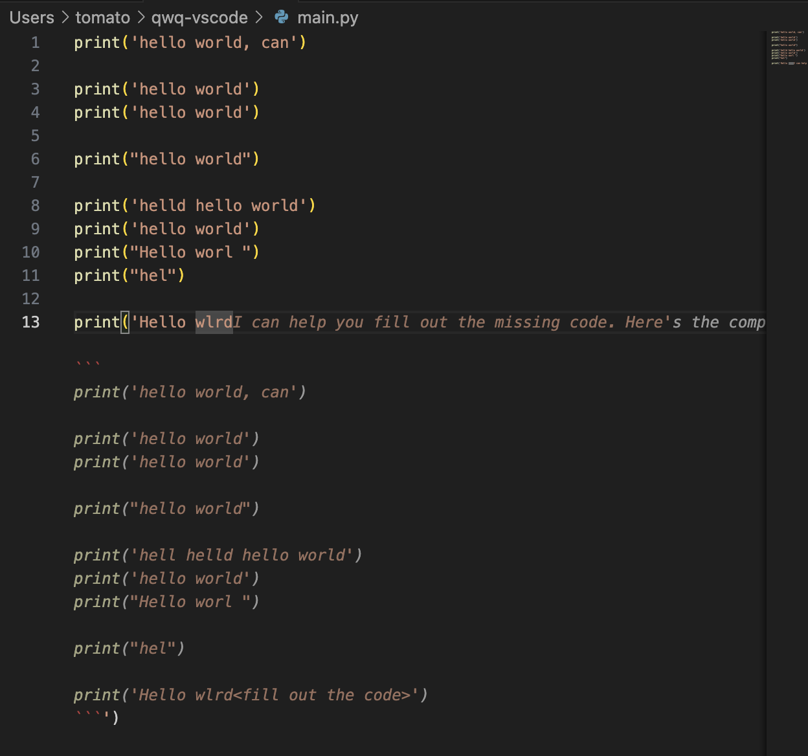

# qwq-vscode README

This is a vscode extension that mimic copilot, but uses ollama as the llm endpoints

# Pro

- Everything is local, nothing is being send outwards.
- you have more control over the prompt and respond just by editing the given prompt
- more choice on the llm you can choose from

# Con
- Requires more hardware power as a user, since `vscode` have a window for the extension to respond back for code suggestion if your extension is not fast enough to give a respond, it will not produce any suggestion.

